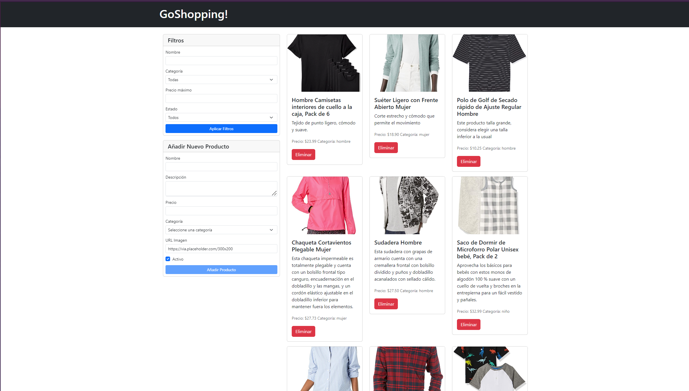

# ClothingStore

Aplicación web desarrollada en Angular 18 que simula una tienda de ropa, solo parte frontend 

### Descripción de la aplicación

Página web que simula una tienda de ropa, puedes realizar filtros y añadir productos.

### Capturas de la aplicación

